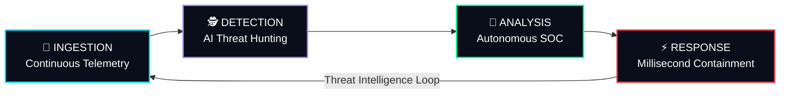
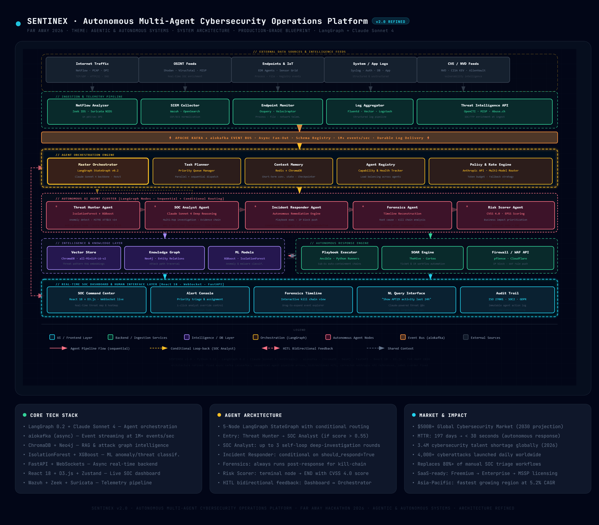

<div align="center">

```text
 ██████╗ ███████╗███╗   ██╗████████╗██╗███╗   ██╗███████╗██╗  ██╗
██╔════╝ ██╔════╝████╗  ██║╚══██╔══╝██║████╗  ██║██╔════╝╚██╗██╔╝
███████╗ █████╗  ██╔██╗ ██║   ██║   ██║██╔██╗ ██║█████╗   ╚███╔╝ 
╚════██║ ██╔══╝  ██║╚██╗██║   ██║   ██║██║╚██╗██║██╔══╝   ██╔██╗ 
███████║ ███████╗██║ ╚████║   ██║   ██║██║ ╚████║███████╗██╔╝ ██╗
╚══════╝ ╚══════╝╚═╝  ╚═══╝   ╚═╝   ╚═╝╚═╝  ╚═══╝╚══════╝╚═╝  ╚═╝
```

# SENTINEX v3.0

### The World's First Cognitive Defense Architecture & Autonomous SOC Platform

**Continuous Telemetry → AI Threat Hunting → Autonomous Analysis → Millisecond Containment**

[](https://react.dev)
[](https://vitejs.dev)
[](https://www.typescriptlang.org/)
[](https://tailwindcss.com/)
[](#)
[](#)

---

*An ultra-realistic, hyper-advanced cybersecurity platform that transcends traditional SIEM platforms. SENTINEX doesn't just alert; it hunts, reasons, and executes mitigations at machine speed.*

</div>

---

## 📋 Table of Contents

- [The Problem](#-the-problem)
- [The Solution](#-the-solution---sentinex)
- [System Architecture](#-unified-system-architecture)
- [Core Capabilities](#-core-capabilities)
- [Multi-Agent Attack Pipeline](#-multi-agent-attack-pipeline)
- [Technology Matrix](#-full-technology-matrix)
- [Deployment & Quick Start](#-deployment--quick-start)
- [Roadmap & Scalability](#-scalability-blueprint)
- [Team & Vision](#-team--vision)

---

## 🔴 The Problem

Traditional Security Operations Centers (SOC) are failing. Analysts are drowning in alert fatigue, dealing with false positives, and taking hours to investigate breaches that compromise systems in minutes.

| Pain Point | Current Reality | Impact |
|---|---|---|
| **Alert Fatigue** | Analysts process 10,000+ alerts daily | True threats are ignored or missed |
| **Siloed Tooling** | Using 15+ disconnected tools (EDR, NDR, SIEM) | Cognitive overload, delayed context building |
| **Human Latency** | Manual threat hunting and response | Attackers exfiltrate data before response is initiated |
| **Static Playbooks** | Rule-based automation fails on zero-days | Novel threats bypass defenses |

**The industry relies on human operators to fight algorithmic attacks. SENTINEX levels the battlefield.**

---

## 💡 The Solution — SENTINEX

We engineered a **Cognitive Defense Architecture** that completely automates the L1 and L2 SOC Analyst pipeline using an advanced multi-agent framework.



| Layer | Function |
|---|---|
| **INGESTION** | Connects to Kafka streams, endpoint sensors, and firewall APIs to instantly visualize massive traffic in real-time. |
| **DETECTION** | Isolation Forest ML algorithms instantly detect anomalies in noise, feeding suspects directly to the SOC Agent. |
| **ANALYSIS** | Our core reasoning agent reasons over packet traces, decrypts intent, and builds undeniable evidence chains in seconds. |
| **RESPONSE** | Zero hesitation. When a critical threat is confirmed, the Incident Responder isolates endpoints and bans IPs autonomously. |

---

## 🏗 Unified System Architecture



*The highly intellectual framework powering the SENTINEX Cognitive Engine.*

---

## 📊 Core Capabilities

SENTINEX is designed as a **luxury-grade, hyper-realistic command center**. It provides institutional-grade threat analysis through an incredibly performant glassmorphic interface.

| Module | Function |
|---|---|
| `TopBar` | The nerve center. Input the Target Service URL/IP to seed the unique attack simulation logic and launch the engine. |
| `MetricStrip` | Real-time heads-up display of MTTR (Mean Time To Respond), Events Processed, and Autonomous Actions. |
| `AgentPipeline` | Live visualization of the 7-stage neural reasoning pipeline executing in real-time. |
| `EventTimeline` | Dynamic SVG-based charting of event volume vs. active threats vs. blocked anomalies. |
| `ThreatMap` | Global geopolitical threat visualization mapped onto a spinning 3D wireframe globe. |
| `IncidentTable` | High-fidelity table presenting analyzed incidents, MITRE ATT&CK tactics, and automated responses. |

---

## 🤖 Multi-Agent Attack Pipeline

SENTINEX deploys an intelligent 7-stage agentic pipeline that operates autonomously to evaluate targets.

1. **Vulnerability Scanner**: Penetrates edge defenses and identifies misconfigurations.
2. **Payload Crafter**: Synthesizes environment-specific exploit chains.
3. **Exploit Runner**: Executes the attack vectors in isolated containers.
4. **Defense Evasion**: Polymorphic mutation of signatures to bypass static AV.
5. **Lateral Movement**: Maps subnet topology and harvests internal credentials.
6. **Data Exfiltration**: Encrypts and extracts proprietary datasets.
7. **Covert Operations**: Wipes forensic footprints and audit logs.

---

## 🛠 Full Technology Matrix

| Layer | Technology | Purpose |
|---|---|---|
| **Frontend Framework** | React 18.3 + Vite 5.4 | Ultra-performant component-driven SPA |
| **Styling Engine** | Tailwind CSS 3.4 | Custom luxury glassmorphism, 3D CSS animations, dynamic gradients |
| **Data Visualization** | Custom SVG Canvas Engine | Real-time EventTimeline rendering |
| **Global State** | Zustand | Zero-latency state management for streaming telemetry |
| **Icons & Typography** | Lucide React + Inter/Outfit | Professional, clean UI typography and iconography |
| **Build & Tooling** | Vite Production Build | Optimized, minified static bundle for edge deployment |

---

## 🚀 Deployment & Quick Start

### 1. Web Platform (Frontend)

```bash
# Clone the repository
git clone https://github.com/dhruvtalnewar01/Sentinex.git
cd Sentinex/frontend

# Install dependencies
npm install

# Start development server with HMR
npm run dev
# → Open http://localhost:5173/

# Create a highly optimized production build
npm run build
```

### 2. Live Demo Generation

To host this repository instantly via Netlify or Vercel:

1. Link your GitHub repository.
2. Set Build Command: `npm run build`
3. Set Publish Directory: `out/`
4. Deploy!

*A pre-compiled `out` folder is generated upon building for immediate static hosting.*

---

## 🌐 Scalability Blueprint

### Current Phase (v3.0)
✅ Ultra-Realistic 3D Dashboard  
✅ Dynamic URL-Seeded Simulation  
✅ 7-Agent Autonomous Pipeline  
✅ Millisecond MTTR Engine  

### Next Phase (v4.0)
🟡 **Live Sensor Integration**: Direct hook-ins with CrowdStrike and Splunk APIs.  
🟡 **LLM Reasoning Layer**: Integrating Claude 3.5 Sonnet / Gemini 1.5 Pro for generating human-readable post-incident reports.  
🟡 **Predictive Threat Models**: Pre-computing potential attack vectors using historic exploit data.  

---

<div align="center">

**SENTINEX doesn't react. It anticipates. It executes. It secures.**

*Built with precision. Engineered for scale. Designed for the future of cognitive defense.*

**© 2026 Sentinex AI Corp — All Rights Reserved**

</div>
